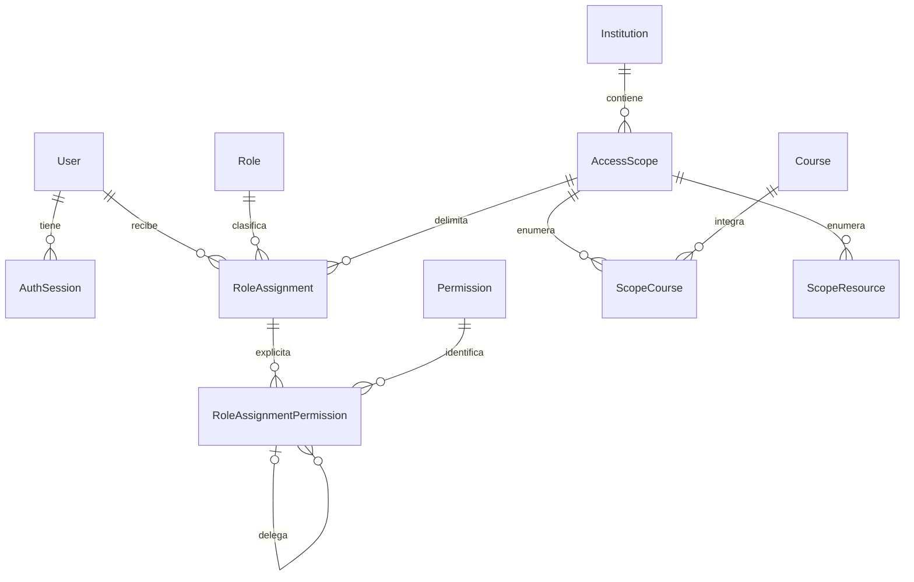
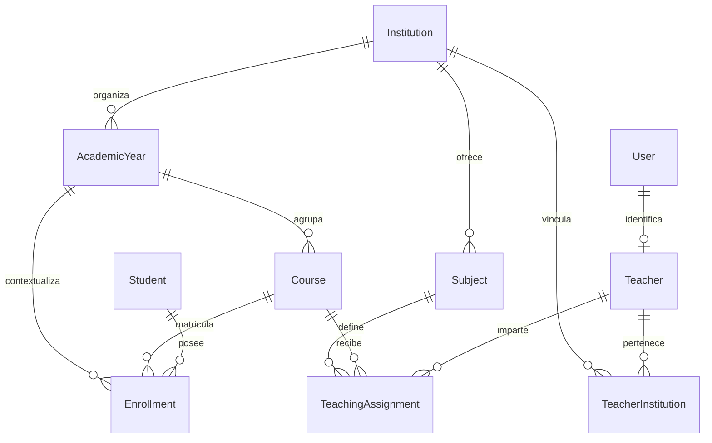
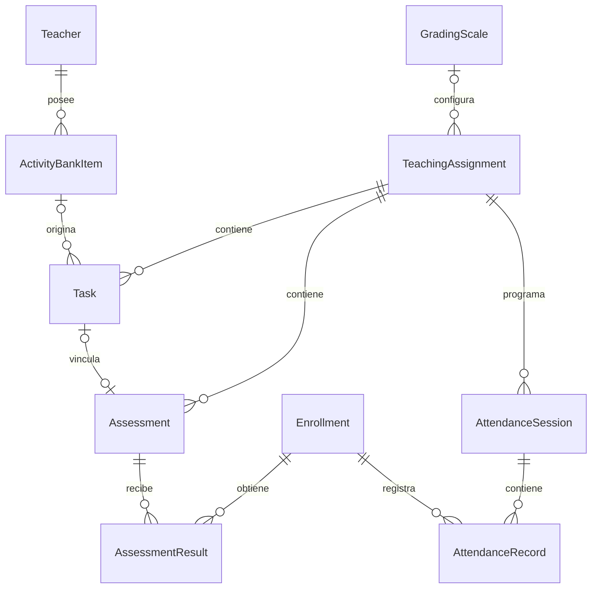
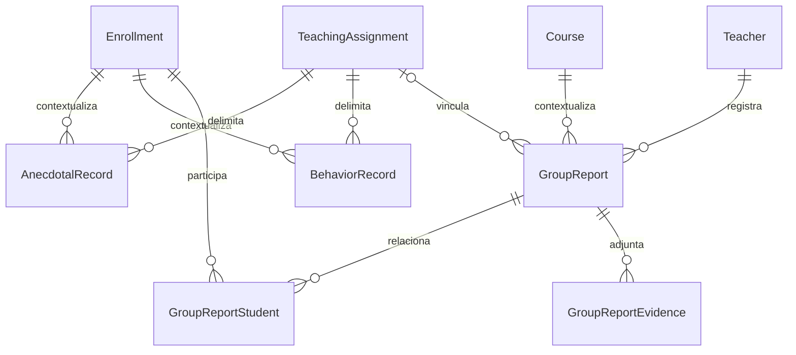
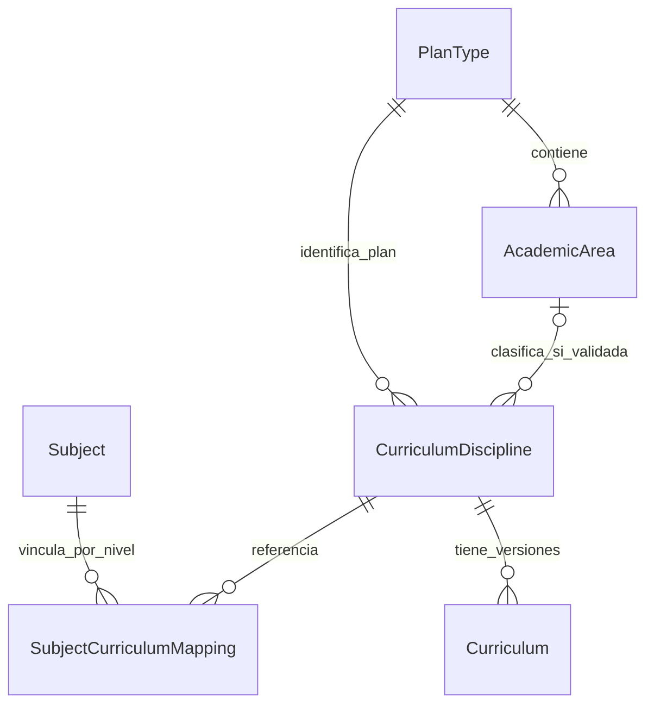
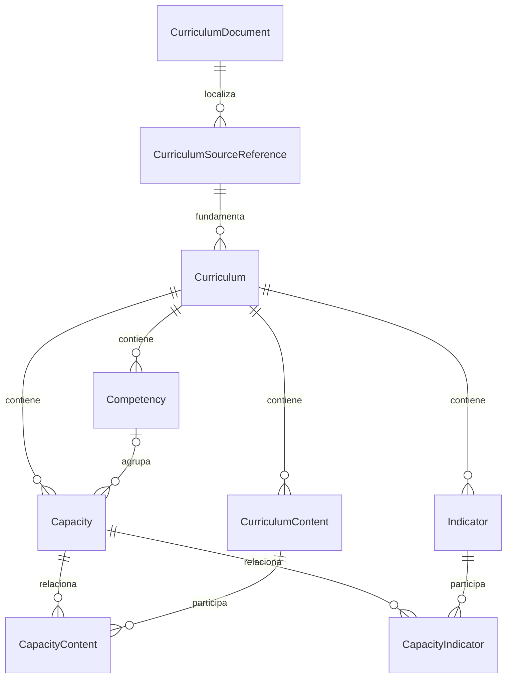
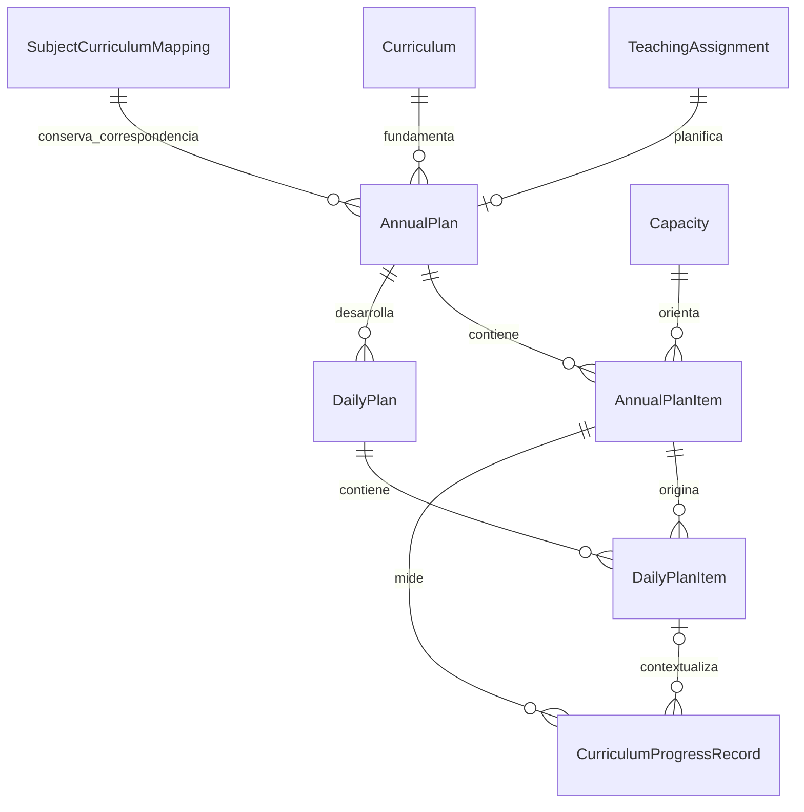
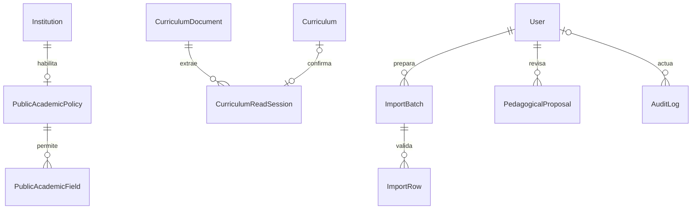

# EduGestor V1.0 — Modelo de datos relacional

**Destino:** `docs/architecture/DATABASE.md`  
**Fecha de diseño:** 24 de septiembre de 2026.  
**Actualización:** 25 de septiembre de 2026 — refinamiento curricular aprobado; clasificación parcial sin áreas ficticias.  
**Plataforma:** PostgreSQL + Prisma ORM.  
**Línea base de requisitos:** `REQUIREMENTS.md`, V1.0, revisión documental 4, del 22 de septiembre de 2026; 34 RF y 15 RNF; D-01 a D-07 RESUELTAS.  
**Huella SHA-256 de la línea base:** `fe5c576790abf959b92bf0bf910bc1d8df26392c15ba961e15d5b42f2c333c69`.

Este documento incorpora el refinamiento curricular aprobado el 25 de septiembre de 2026 sin modificar la revisión 4 de `REQUIREMENTS.md`, sus 34 RF, sus 15 RNF ni las decisiones D-01 a D-07.

Este documento diseña la persistencia del alcance aprobado. No modifica requisitos ni incorpora nuevos módulos funcionales. Las tablas auxiliares, versiones y estados técnicos sirven para garantizar integridad, autorización, revisión humana y trazabilidad. No se incluyen todavía un esquema Prisma ejecutable, migraciones ni código de aplicación.

## 1. Convenciones del modelo

### 1.1. Identidad, tipos y campos comunes

Todas las entidades y tablas asociativas descritas, incluido `AuditLog`, tienen `id UUID PRIMARY KEY`, generado internamente. En Prisma corresponde a un campo `String` con tipo nativo `@db.Uuid`. Una cédula, un nombre o un código nunca sustituyen al UUID como clave primaria.

Salvo indicación contraria:

- Cada entidad tiene `createdAt` y `updatedAt` de tipo `timestamptz`. Una asociación inmutable puede conservar solo `createdAt`.
- Los registros operativos editables tienen `rowVersion Int` para detectar actualizaciones concurrentes; no constituye una versión funcional visible.
- `?` identifica un campo nullable; los demás campos son obligatorios. `FK X` significa referencia real a `X.id`. Cada FK implica una relación N:1, salvo que se indique `UNIQUE`, en cuyo caso es 1:1. Cada tabla asociativa representa una relación M:N y tiene su propia PK UUID, además de la unicidad del par.
- Las fechas académicas utilizan `date`; los instantes de acceso y auditoría, `timestamptz`. Los períodos estimados se representan mediante fechas de inicio y fin.
- Puntajes, porcentajes, calificaciones y horas usan `numeric`/`Decimal`, nunca punto flotante. Se propone `numeric(18,6)` para cálculo persistido; el redondeo formal lo define la escala y no el tipo de columna.
- Los textos descriptivos usan `text`; las claves normalizadas usan `text` con reglas deterministas de normalización. La normalización de cédula preserva ceros iniciales y no inventa valores para personas sin cédula.
- Toda referencia a autor usa `User`; una referencia a docente usa `Teacher`. No se crea una cuenta de usuario para cada estudiante.
- `createdById` y `updatedById`, cuando se indican, son FK a `User`. Los campos de actor no se aceptan libremente del cliente: se obtienen de la sesión autenticada.
- Se prefieren claves naturales `UNIQUE` normalizadas para prevenir duplicados, sin confundirlas con la PK.

Los campos principales se presentan por entidad; los campos comunes no se repiten en todas las tablas. Los atributos funcionales no especificados por la línea base no se presuponen obligatorios.

### 1.2. Capas de integridad

| Capa | Responsabilidad |
|---|---|
| PostgreSQL | PK, FK, `UNIQUE`, `NOT NULL`, `CHECK`, unicidad parcial, transacciones y restricciones contra pérdida histórica. |
| Backend transaccional | Autorización por permiso y ámbito, comparación de ámbitos, revisión/confirmación, validaciones entre tablas y control de concurrencia. |
| Prisma | Relaciones, tipos, consultas, escritura transaccional y migraciones versionadas. |
| Zod | Validación de contratos de entrada; no sustituye autorización ni restricciones SQL. |

Las restricciones SQL que no se expresen en el esquema Prisma se incorporarán explícitamente a las migraciones SQL. Las comprobaciones entre filas/tablas que deban ser invariantes persistentes requieren FK compuestas o constraint triggers; no se representan como un `CHECK` que consulte otras tablas.

## 2. Seguridad, ámbitos y delegación — D-01

### 2.1. Entidades

| Entidad | Propósito y campos principales | Claves y restricciones |
|---|---|---|
| `User` | Identidad de acceso: `login`, `loginNormalized`, `passwordHash`, `accountKind`, `isActive`, `disabledAt?`. | `UNIQUE(loginNormalized)`. El hash no se retorna en consultas. `accountKind` distingue cuenta ordinaria y raíz/técnica; no se asigna desde formularios ordinarios. |
| `AuthSession` | Sesión revocable: `userId FK User`, `tokenHash`, `expiresAt`, `revokedAt?`, `lastSeenAt?`. | `UNIQUE(tokenHash)`. Se conserva solo el hash de un token opaco de alta entropía; la cookie contiene el token y tiene atributos HttpOnly y Secure en producción. |
| `Role` | Rol reconocido por el sistema: `code`, `name`. | `UNIQUE(code)`. Un rol clasifica una asignación; no concede permisos globales implícitos. |
| `Permission` | Acción autorizable del alcance V1.0: `code`, `description`. | `UNIQUE(code)`. Catálogo técnico de acciones aprobadas; no es un motor para crear funcionalidades. |
| `AccessScope` | Ámbito: `institutionId FK Institution`, `kind`, `createdById`. | `kind`: institución, conjunto de cursos o conjunto de recursos. Una fila pertenece a una sola institución. Varios ámbitos cubren varias instituciones, si están autorizados. |
| `ScopeCourse` | Cursos de un ámbito: `scopeId FK AccessScope`, `courseId FK Course`. | `UNIQUE(scopeId, courseId)`. Solo para un ámbito de cursos; todos pertenecen a su institución. |
| `ScopeResource` | Recursos explícitos de un ámbito: `scopeId FK AccessScope` y exactamente una FK de destino de la lista cerrada del apartado 2.2. | Un destino por fila; unicidad parcial de `(scopeId, destinoId)` para cada tipo. Solo para ámbitos de recursos. |
| `RoleAssignment` | Vincula rol, usuario y ámbito: `userId FK User`, `roleId FK Role`, `scopeId FK AccessScope`, `grantedById FK User`, `revokedAt?`, `revokedById? FK User`. | Índice único parcial `(userId, roleId, scopeId) WHERE revokedAt IS NULL`. Una asignación revocada permanece como historia. |
| `RoleAssignmentPermission` | Permiso explícito dentro de esa asignación: `roleAssignmentId FK RoleAssignment`, `permissionId FK Permission`, `parentGrantId? FK RoleAssignmentPermission`, `delegatedById FK User`, `revokedAt?`. | `UNIQUE(roleAssignmentId, permissionId)`. La referencia padre identifica de qué concesión procede la delegación de ese permiso. |

No se utiliza un vínculo global `UserPermission`. Los permisos se evalúan siempre junto con el ámbito de la misma `RoleAssignment`. Un conjunto inicial de permisos por rol puede facilitar el bootstrap, pero las concesiones efectivas quedan registradas explícitamente en `RoleAssignmentPermission`.

### 2.2. Representación de recursos específicos

`ScopeResource` utiliza FK tipadas nullable, no un par libre `entityType/entityId` sin integridad referencial. Destinos permitidos del modelo:

| FK nullable de destino | Entidad |
|---|---|
| `teacherInstitutionId` | `TeacherInstitution` |
| `subjectId` | `Subject` |
| `teachingAssignmentId` | `TeachingAssignment` |
| `enrollmentId` | `Enrollment` |
| `taskId` | `Task` |
| `assessmentId` | `Assessment` |
| `attendanceSessionId` | `AttendanceSession` |
| `anecdotalRecordId` | `AnecdotalRecord` |
| `behaviorRecordId` | `BehaviorRecord` |
| `groupReportId` | `GroupReport` |
| `gradingScaleId` | `GradingScale` |
| `annualPlanId` | `AnnualPlan` |
| `dailyPlanId` | `DailyPlan` |

Un `CHECK` exige exactamente una FK no nula. Una validación transaccional verifica la institución del recurso y su existencia. Los hijos contenidos, por ejemplo resultados de una evaluación o evidencias de un informe, heredan el contexto de su padre; el permiso de la operación sigue siendo obligatorio. Incluir un recurso no concede acceso a sus hermanos ni a otros datos del estudiante.

Los datos globales de `Student` se alcanzan a través de una matrícula autorizada; nunca mediante un ámbito que exponga automáticamente todas sus matrículas. `Teacher` se administra en su vinculación institucional, con las restricciones necesarias para no afectar ámbitos ajenos. El banco privado no es un destino delegable. La base curricular validada es una referencia compartida; su lectura no concede administración del sistema ni de instituciones.

### 2.3. Reglas de autorización y delegación

1. Una cuenta ordinaria no obtiene privilegios globales por ser administradora. Se requiere una concesión efectiva del permiso de la acción sobre el recurso solicitado.
2. El ámbito institucional contiene sus cursos y recursos institucionales; el ámbito de cursos contiene únicamente los cursos enumerados y sus recursos; el ámbito de recursos contiene únicamente los destinos enumerados y sus hijos contenidos. Un curso no contiene otras secciones ni otros años lectivos.
3. Para crear un administrador o modificar concesiones se requiere el permiso administrativo correspondiente en el ámbito afectado. Para cada permiso concedido debe existir una concesión propia efectiva cuyo ámbito contenga íntegramente el ámbito receptor. Si se necesitan ámbitos diferentes se crean asignaciones separadas.
4. `parentGrantId` pertenece al usuario que delega, concede el mismo permiso y tiene ámbito igual o mayor. No se permiten ciclos, autopadres ni ampliaciones indirectas. Una asignación puede reunir permisos procedentes de concesiones distintas, sin mezclar sus ámbitos para ampliar acceso.
5. Los conjuntos de un ámbito ya utilizado y los vínculos de delegación son inmutables. Un cambio de alcance sustituye la concesión, conserva la anterior revocada y audita el cambio; no edita silenciosamente el ámbito de todos sus descendientes.
6. Un permiso delegado deja de ser efectivo si él, su asignación, el usuario delegante o algún antecedente de delegación deja de ser válido. La revocación no deja permisos descendientes utilizables. La reactivación no resucita concesiones revocadas. Las operaciones administrativas se serializan respecto de cambios concurrentes en la cadena que autoriza la operación.
7. Las concesiones iniciales sin padre solo proceden del bootstrap o de una acción excepcional de la cuenta técnica, registrando motivo y actor en auditoría. La cuenta técnica queda fuera del trabajo cotidiano; crear un administrador ordinario no crea otra cuenta técnica.
8. El acceso docente operativo requiere, además del permiso correspondiente, una `TeachingAssignment` vigente del propio docente. Un rol docente en un curso no otorga acceso a asignaciones ajenas. Los permisos administrativos se evalúan por separado.
9. El banco de actividades se restringe siempre al docente propietario, incluidos lecturas, copias y búsquedas. Una concesión administrativa cotidiana no elimina esa restricción.

## 3. Organización académica y estudiantes — D-02

| Entidad | Propósito y campos principales | Claves, relaciones e integridad |
|---|---|---|
| `Institution` | Institución: `name`, campos de identificación definidos por RF-003, activación común. | 1:N años lectivos, cursos, materias y ámbitos. El nombre no se presume único globalmente. |
| `AcademicYear` | Año lectivo institucional: `institutionId FK Institution`, `label`, `startsOn`, `endsOn`, `isCurrent`. | `UNIQUE(institutionId, label)`; `CHECK(startsOn <= endsOn)`; único parcial `(institutionId) WHERE isCurrent`. Puede no existir un año activo; nunca dos para la misma institución. |
| `Course` | Curso/sección: `institutionId FK Institution`, `academicYearId FK AcademicYear`, `grade`, `section`, `shift`, `btiYear? SmallInt`, activación común. | `UNIQUE(institutionId, academicYearId, grade, section, shift)`. Grado, sección y turno se normalizan antes de comparar. Año e institución deben coincidir. `btiYear` es NULL o 1, 2, 3; no es obligatorio para crear el curso. |
| `Subject` | Materia institucional: `institutionId FK Institution`, `name`, `nameNormalized`, activación común. | `UNIQUE(institutionId, nameNormalized)`. Catálogo institucional genérico; tiene cero o más correspondencias por año en SubjectCurriculumMapping y puede operar sin referencia ni malla curricular. |
| `Teacher` | Identidad docente: `userId FK User`, `displayName`, datos básicos aprobados, activación común. | `UNIQUE(userId)`: User 1:0..1 Teacher. Puede tener varias vinculaciones institucionales y roles adicionales. |
| `TeacherInstitution` | Vinculación institucional del docente: `teacherId FK Teacher`, `institutionId FK Institution`, `endedAt?`. | `UNIQUE(teacherId, institutionId)`. Rehabilitar una vinculación conserva su identidad; los cambios quedan auditados. No reemplaza roles ni asignaciones académicas. |
| `TeachingAssignment` | Docente–Curso–Materia: `teacherId FK Teacher`, `institutionId FK Institution`, `courseId FK Course`, `subjectId FK Subject`, `gradingScaleId? FK GradingScale`, `endedAt?`. | `UNIQUE(teacherId, courseId, subjectId)`. FK compuesta `(teacherId, institutionId)` a TeacherInstitution. Curso, materia y escala, si existe, pertenecen a la institución. El año se obtiene del curso. |
| `Student` | Persona estudiante independiente de matrícula: `givenNames`, `familyNames`, `nationalId?`, `nationalIdNormalized?`, activación común. | `UNIQUE(nationalIdNormalized)` con múltiples NULL permitidos. Cédula original y normalizada son ambas nulas o ambas informadas. No se crea una cédula ficticia. |
| `Enrollment` | Matrícula: `studentId FK Student`, `courseId FK Course`, `academicYearId FK AcademicYear`. | `UNIQUE(studentId, courseId, academicYearId)`. FK compuesta `(courseId, academicYearId)` a Course. No se impone matrícula única por estudiante y año en toda la aplicación. |

### 3.1. Integridad del contexto

`AcademicYear` representa el año lectivo institucional; `Course.btiYear` representa el nivel 1.º, 2.º o 3.º BTI cuando corresponde. Este último se informa explícitamente y debe ser coherente con `grade`; no se interpreta automáticamente cualquier “3.º” como 3.º BTI. Su ausencia no bloquea materias, asignaciones ni el Hito 1, pero debe resolverse antes de vincular planificación curricular BTI.

Se agregan claves candidatas compuestas de soporte: `AcademicYear(id, institutionId)`, `Course(id, institutionId)`, `Course(id, academicYearId)`, `Subject(id, institutionId)` y `GradingScale(id, institutionId)`. Permiten FK compuestas desde los registros que repiten contexto y evitan relaciones entre instituciones incompatibles. No son identidades alternativas expuestas al público.

La asignación mantiene el mismo docente, curso y materia una vez que tiene historia. Un cambio a otro docente crea otra asignación, y finaliza la anterior cuando corresponda; no reatribuye resultados ni autoría. Una asignación finalizada conserva su historial, pero no permite nuevas operaciones docentes ordinarias. No se agrega una restricción de docente único por curso y materia: el alcance solo exige que no se repita la misma terna.

Las FK a matrícula en resultados, asistencia y seguimiento deben corresponder al curso y año de la asignación. Esta regla se verifica transaccionalmente y mediante constraint triggers, o mediante FK compuestas equivalentes si se materializan esos campos de contexto. No basta con que la matrícula y la asignación existan por separado.

Cambiar nombres, corregir cédula o desactivar una entidad no cambia su UUID. No se permite trasladar un curso con historia a otra institución/año ni cambiar una matrícula con historia para que represente otra persona o curso. La corrección de campos identificativos conserva trazabilidad y no reasigna hechos académicos.

## 4. Tareas, evaluaciones y calificaciones — D-03

### 4.1. Entidades y fuente única de resultados

| Entidad | Propósito y campos principales | Claves y reglas |
|---|---|---|
| `ActivityBankItem` | Plantilla privada: `ownerTeacherId FK Teacher`, `kind`, `title`, `description`, `instrumentContent?`, `scoringKind`, `suggestedMaxPoints?`. | 1:N copias opcionales en tareas/evaluaciones. No incluye matrículas, resultados ni información de estudiantes. |
| `Task` | Tarea concreta: `teachingAssignmentId FK TeachingAssignment`, `title`, `description`, `maxPoints`, `scoringKind`, `sourceBankItemId? FK ActivityBankItem`, `sourceTaskId? FK Task`, `createdById`. | `maxPoints >= 0`. Una copia guarda contenido propio, no una vista viva de la plantilla. Origen opcional, sin autorreferencia ni ciclos de copia. |
| `Assessment` | Evaluación independiente o asociada: `teachingAssignmentId FK TeachingAssignment`, `title`, `description?`, `taskId? FK Task`, `sourceBankItemId? FK ActivityBankItem`, `sourceAssessmentId? FK Assessment`, `instrumentContent?`, `standaloneMaxPoints?`, `standaloneScoringKind?`, `createdById`. | `UNIQUE(taskId)` cuando no es NULL. Si no hay tarea, máximo y tipo propios obligatorios; si hay tarea, ambos nulos y se obtienen de ella. Tarea y evaluación pertenecen a la misma asignación. |
| `AssessmentResult` | Resultado individual: `assessmentId FK Assessment`, `enrollmentId FK Enrollment`, `status`, `earnedPoints?`, `evaluatedAt?`, `evaluatedById? FK User`. | `UNIQUE(assessmentId, enrollmentId)`. PENDIENTE implica puntaje y metadatos de evaluación nulos; EVALUADO exige puntaje no negativo, fecha y actor. |
| `GradingScale` | Versión reproducible de una escala: `institutionId FK Institution`, `name`, `version`, `minimumGrade`, `maximumGrade`, `conversionDefinition JsonB`, `roundingDefinition JsonB`, `lockedAt?`, `createdById`. | `UNIQUE(institutionId, name, version)`, `version > 0`, `minimumGrade <= maximumGrade`. Definiciones completas, validadas y versionadas; no ejecutan código arbitrario. |

`conversionDefinition` y `roundingDefinition` son documentos pequeños de configuración, con un contrato discriminado y documentado: límites/valores de la escala, correspondencias o regla de conversión y regla explícita de redondeo. No son entidades académicas incrustadas ni resultados. El contrato debe representar la escala configurada antes de habilitar calificaciones formales; este diseño no fija umbrales ni una fórmula institucional ausente en los requisitos. Una escala utilizada queda bloqueada para edición: una modificación crea otra versión; cambiar la versión aplicada a una asignación es explícito y auditado, conservando las anteriores.

Una tarea puede existir sin evaluación ni resultados. Al registrar su primer resultado se utiliza su única evaluación asociada, en la misma transacción si debe crearse. Esto es una representación interna de RF-009/RF-013: no obliga al usuario a crear previamente una evaluación para definir la tarea. Una evaluación independiente no requiere tarea, actividad del banco ni instrumento previo.

La relación opcional Task 1:0..1 Assessment evita múltiples planillas calificables para una misma tarea. El contenido/instrumento reutilizado se copia a la instancia; la FK de procedencia no permite acceder a un banco ajeno. Reutilizar nunca copia resultados ni estudiantes.

### 4.2. Reglas de puntuación

- `scoringKind = ORDINARIA` aporta su máximo al denominador. `FUERA_DE_ESCALA` aporta solamente los puntos obtenidos al numerador. Ambas clases conservan su máximo propio para definir y validar la actividad.
- El conjunto calificable de una asignación contiene cada tarea una vez y las evaluaciones independientes una vez. Una evaluación vinculada a tarea no se suma nuevamente como otra actividad.
- El puntaje ordinario posible es la suma de máximos ordinarios de ese conjunto. El puntaje obtenido es la suma de resultados evaluados ordinarios y adicionales. Los pendientes se muestran como tales y los acumulados incompletos se identifican como parciales.
- No existir una fila `AssessmentResult` también significa pendiente para una matrícula elegible; no se genera un cero. Un resultado cero requiere un registro EVALUADO con `earnedPoints = 0`.
- `porcentaje = puntos obtenidos / puntos ordinarios posibles × 100`. Con denominador cero no se emite un porcentaje ni una nota formal ficticios. El porcentaje puede superar 100. La conversión reproducible aplica el máximo formal cuando el porcentaje supera 100 y nunca lo excede por redondeo.
- La elegibilidad se obtiene de la matrícula y del contexto de la asignación, no de una lista duplicada de estudiantes dentro de cada tarea.
- `AssessmentResult` es la única fuente persistida de puntajes individuales. Planillas, dashboard, perfil y reportes calculan sobre esa fuente; no mantienen tablas independientes de notas que puedan divergir.

### 4.3. Cambio del máximo con resultados existentes

El backend detecta resultados antes de modificar el máximo efectivo. Devuelve advertencia y datos necesarios para confirmar; sin confirmación no hay escritura. Tras confirmar, una transacción bloquea o verifica la versión de la tarea/evaluación y sus resultados, cambia el máximo, recalcula las salidas derivadas y registra actor, valor anterior/nuevo y efecto en `AuditLog`.

No se reemplazan silenciosamente los puntajes obtenidos. Si una reducción deja un resultado existente por encima del nuevo máximo, se conserva y se informa como consecuencia del cambio confirmado; la nota formal sigue limitada por la escala. Las validaciones de nuevos resultados comparan el puntaje con el máximo efectivo de la actividad; no se aplica un `CHECK` estático entre tablas que impida conservar el caso histórico anterior.

## 5. Asistencia — D-02 y D-04

| Entidad | Propósito y campos principales | Claves y reglas |
|---|---|---|
| `AttendanceSession` | Sesión concreta de clase: `teachingAssignmentId FK TeachingAssignment`, `classDate`, `createdById`. | TeachingAssignment 1:N sesiones. No hay `UNIQUE(asignación, fecha)`: pueden existir varias sesiones el mismo día. |
| `AttendanceRecord` | Asistencia individual: `attendanceSessionId FK AttendanceSession`, `enrollmentId FK Enrollment`, `status`, `isJustified Boolean`, `justificationObservation?`, `observation?`, `recordedById FK User`. | `UNIQUE(attendanceSessionId, enrollmentId)`. Matrícula del mismo curso y año que la sesión. |

`AttendanceStatus` contiene exactamente los estados mínimos aprobados: `PRESENTE`, `AUSENTE`, `LLEGADA_TARDIA`, `SALIDA_ANTICIPADA`. La justificación es independiente: justificar AUSENTE conserva AUSENTE; no existe un estado JUSTIFICADO. La observación justificativa es interna y nunca se devuelve en la consulta pública.

La ausencia de sesión o de registro no se transforma en AUSENTE. Los resúmenes diarios o por período agrupan registros reales e identifican sesiones; no suponen un único registro por día ni cambian la unidad de cómputo sin indicarlo.

## 6. Seguimiento e informe grupal — D-05

| Entidad | Propósito y campos principales | Claves y reglas |
|---|---|---|
| `AnecdotalRecord` | Hecho individual: `teachingAssignmentId FK TeachingAssignment`, `enrollmentId FK Enrollment`, `eventDate`, `description`, `observations?`, `authorUserId FK User`. | Matrícula compatible con la asignación; edición autorizada y auditada. |
| `BehaviorRecord` | Registro de conducta: `teachingAssignmentId FK TeachingAssignment`, `enrollmentId FK Enrollment`, `eventDate`, `description`, `observations?`, `authorUserId FK User`. | Misma integridad contextual. Entidad separada del registro anecdótico; no produce cambios automáticos de calificación. |
| `GroupReport` | Acontecimiento del grupo: `institutionId FK Institution`, `courseId FK Course`, `teacherId FK Teacher`, `subjectId? FK Subject`, `teachingAssignmentId? FK TeachingAssignment`, `eventDate`, `category`, `description`, `observations?`, `createdById`. | Curso e institución coherentes. Materia y asignación son ambas nulas o ambas informadas; si existen, la asignación coincide con docente, curso y materia. |
| `GroupReportStudent` | Estudiantes relacionados opcionalmente: `groupReportId FK GroupReport`, `enrollmentId FK Enrollment`. | `UNIQUE(groupReportId, enrollmentId)`. Cada matrícula pertenece al curso/año del informe. |
| `GroupReportEvidence` | Archivo privado opcional: `groupReportId FK GroupReport`, `slot SmallInt`, `originalName`, `storageKey`, `mediaType`, `sizeBytes BigInt`, `sha256`, `uploadedById FK User`. | `UNIQUE(groupReportId, slot)`; `CHECK(slot BETWEEN 1 AND 3)`; `CHECK(sizeBytes > 0 AND sizeBytes <= 5000000)`; `UNIQUE(storageKey)`. |

Categorías exactas: `AUSENCIA_COLECTIVA`, `RETIRO_COLECTIVO`, `COMPORTAMIENTO_GRUPAL`, `EVENTO_INSTITUCIONAL`, `INCIDENTE_GRUPAL`, `OTRO`. `description` no vacía permite describir la situación o categoría cuando se usa OTRO; no se necesita crear otro catálogo funcional.

Un informe no requiere estudiantes relacionados, asistencias, anécdotas ni registros de conducta previos. El docente autor debe tener autorización sobre el curso; si hay materia, debe cumplir también la asignación indicada. Un informe sin materia conserva contexto institucional y de curso completo.

Las evidencias solo aceptan JPG (`image/jpeg`), PNG (`image/png`) y PDF (`application/pdf`). Se valida contenido real, tamaño y tipo; la extensión declarada no basta. Las posiciones 1–3 y su unicidad limitan a tres archivos incluso con cargas concurrentes. El límite aprobado es decimal: **5 MB = 5.000.000 bytes por archivo**.

Los bytes se almacenan fuera de las tablas en almacenamiento privado persistente; la base guarda metadatos y una clave opaca. Los accesos comprueban permisos del informe y nunca exponen rutas internas. Persistir archivo y metadatos requiere un flujo que no deje referencias a cargas fallidas, y limpieza técnica de archivos temporales no confirmados. Los respaldos incluyen ambos componentes.

Consultar/imprimir un informe lee sus propios datos. No genera automáticamente faltas de asistencia, sanciones, conducta ni notas individuales.

## 7. Currículo y procedencia — D-07

### 7.1. Entidades curriculares

| Entidad | Propósito y campos principales | Claves y reglas |
|---|---|---|
| `PlanType` | Tipo de plan curricular: `code`, `name`. | `UNIQUE(code)`. PlanType 1:N AcademicArea y 1:N CurriculumDiscipline. |
| `AcademicArea` | Área académica: `planTypeId FK PlanType`, `code`, `name`. | `UNIQUE(planTypeId, code)` y clave candidata `UNIQUE(id, planTypeId)` para integridad compuesta. |
| `CurriculumDiscipline` | Disciplina curricular: `planTypeId FK PlanType`, `academicAreaId? FK AcademicArea`, `code`, `officialName`. | `UNIQUE(planTypeId, code)`. Plan obligatorio, área nullable. Si existe área, FK compuesta `(academicAreaId, planTypeId)` a AcademicArea `(id, planTypeId)` garantiza que pertenece al mismo plan. |
| `SubjectCurriculumMapping` | Correspondencia institucional por nivel BTI: `subjectId FK Subject`, `btiYear SmallInt`, `curriculumDisciplineId FK CurriculumDiscipline`, `retiredAt?`, `createdById`, `updatedById`. | `btiYear IN (1,2,3)`. Índice único parcial `(subjectId, btiYear) WHERE retiredAt IS NULL`: una correspondencia vigente. Las retiradas se conservan. |
| `CurriculumDocument` | Documento oficial o expresamente validado: `title`, `sourceKind`, `sourceReference`, `storageKey?`, `sha256?`, `validatedById? FK User`, `validatedAt?`. | `sourceKind` OFICIAL o VALIDADA. Una fuente validada exige actor y fecha. Una referencia externa y/o el archivo permite localizar la fuente. |
| `CurriculumSourceReference` | Ubicación trazable: `documentId FK CurriculumDocument`, `page?`, `section?`, `originReference?`. | `page > 0` cuando exista. Documento obligatorio; página/sección se conservan si están disponibles, sin inventarlas. |
| `Curriculum` | Malla curricular versionada: `curriculumDisciplineId FK CurriculumDiscipline`, `btiYear SmallInt`, `version`, `title`, `sourceReferenceId FK CurriculumSourceReference`, `confirmedById FK User`, `confirmedAt`. | `UNIQUE(curriculumDisciplineId, btiYear, version)`; `btiYear IN (1,2,3)`; `version > 0`. Mallas completas limitadas a las dos disciplinas aprobadas; una disciplina del catálogo puede no tener ninguna malla. |
| `Competency` | Competencia identificada en la fuente: `curriculumId FK Curriculum`, `code?`, `description`, `sourceReferenceId FK CurriculumSourceReference`. | Curriculum 1:N competencias. No se inventan competencias para documentos que no las distingan. |
| `Capacity` | Capacidad curricular: `curriculumId FK Curriculum`, `competencyId? FK Competency`, `code?`, `description`, `sourceReferenceId FK CurriculumSourceReference`. | Competencia opcional y, cuando existe, del mismo currículo. |
| `CurriculumContent` | Contenido curricular: `curriculumId FK Curriculum`, `code?`, `description`, `sourceReferenceId FK CurriculumSourceReference`. | Curriculum 1:N contenidos. No se presume unicidad global del texto o código. |
| `Indicator` | Indicador curricular: `curriculumId FK Curriculum`, `code?`, `description`, `sourceReferenceId FK CurriculumSourceReference`. | Curriculum 1:N indicadores. |
| `CapacityContent` | Asociación fuente capacidad–contenido: `capacityId FK Capacity`, `contentId FK CurriculumContent`. | `UNIQUE(capacityId, contentId)`; mismo currículo. |
| `CapacityIndicator` | Asociación fuente capacidad–indicador: `capacityId FK Capacity`, `indicatorId FK Indicator`. | `UNIQUE(capacityId, indicatorId)`; mismo currículo. |
| `CurriculumReadSession` | Área técnica de extracción y revisión: `documentId FK CurriculumDocument`, `requestedById FK User`, `status`, `extractedPayload? JsonB`, `reviewedPayload? JsonB`, `reviewedAt?`, `confirmedAt?`, `confirmedCurriculumId? FK Curriculum`. | Una confirmación produce como máximo una versión curricular por sesión; `UNIQUE(confirmedCurriculumId)` cuando existe. El contenido provisional no pertenece a la base curricular confirmada. |

Una sesión corresponde a un currículo de una disciplina y año; si un documento contiene varios, puede originar varias sesiones explícitas. Esto no implica lectura universal de formatos: solo se aceptan los documentos soportados por RF-027.

Las referencias mantienen el documento de origen aunque no sea posible determinar página o sección. Las relaciones M:N evitan duplicar un contenido o indicador cuando la fuente lo vincula con varias capacidades. No se infieren asociaciones que la fuente o su validación no establezcan.

### 7.1.1. Jerarquía completa y clasificación parcial

La jerarquía oficial completa es **PlanType → AcademicArea → CurriculumDiscipline**. Cada disciplina conserva también `planTypeId` obligatorio para representar el tipo de plan conocido cuando el área aún no está validada. Un área NULL significa clasificación incompleta, no ausencia de tipo de plan ni malla validada. No se crean áreas ficticias como “Pendiente”. Cuando se completa el área, la FK compuesta exige el mismo tipo de plan; la FK directa a PlanType sigue siendo obligatoria incluso con área NULL.

Los códigos de catálogo son identificadores internos estables, no supuestos códigos oficiales. No se exige nombre de disciplina globalmente único. Los nombres y ubicaciones se registran conforme a fuentes oficiales o expresamente validadas, sin deducir áreas a partir del nombre de la materia. Completar un área antes desconocida conserva el UUID y queda auditado. No se cambia silenciosamente el tipo de plan o una ubicación ya utilizada para reinterpretar historia.

| Materia institucional / referencia | Tratamiento V1.0 |
|---|---|
| Matemática Aplicada / Matemática Aplicada a la Informática | Correspondencias para 1.º–3.º BTI y seis combinaciones de mallas comprometidas junto con Algorítmica. El nombre institucional puede mantenerse como Matemática Aplicada. |
| Algorítmica / Algorítmica | Correspondencias para 1.º–3.º BTI y mallas completas oficiales o validadas. |
| Dibujo Técnico | Puede existir como materia y como disciplina de referencia sin exigir su malla completa. La materia también funciona sin correspondencia. |
| Diseño Gráfico | Puede relacionarse con 3.º BTI y una disciplina de Plan Optativo, manteniendo `academicAreaId = NULL` hasta disponer de fuente validada para el área. No exige malla completa en V1.0. |

La existencia de un registro de disciplina o de correspondencia no habilita incorporar su malla completa. RF-026/RF-027 mantienen la carga y validación de mallas exclusivamente para Matemática Aplicada a la Informática y Algorítmica, en 1.º, 2.º y 3.º BTI. Esa delimitación se verifica al confirmar la carga y no mediante un enum que limite todo el catálogo de referencias a dos nombres. No se crean filas Curriculum vacías para representar una clasificación parcial.

### 7.1.2. Correspondencias, autorización e historia

Subject 1:N SubjectCurriculumMapping y CurriculumDiscipline 1:N SubjectCurriculumMapping permiten vincular materias institucionales de distintas instituciones a la misma referencia oficial, según nivel BTI. Un Subject puede tener cero correspondencias; una correspondencia puede existir con cero versiones de Curriculum disponibles. El tipo de plan y el área se resuelven a través de la disciplina; no se duplican en Subject ni en la correspondencia.

El año de la correspondencia es `btiYear`, no `AcademicYear`. La unicidad vigente es por `(subjectId, btiYear)`, no solo por la terna con disciplina: la terna permitiría dos referencias simultáneas ambiguas para una misma materia y nivel. V1.0 no incorpora variantes simultáneas por sección o turno.

Modificar una correspondencia usada exige retirar la anterior y crear la nueva en una transacción auditada. Sus claves de materia, año y disciplina no se reescriben para alterar planes existentes. La unicidad parcial evita dos correspondencias vigentes incluso con operaciones concurrentes. Los planes históricos conservan la correspondencia retirada y el currículo concreto que utilizaron; retirarla no elimina ni invalida sus datos históricos, pero impide utilizarla para crear planes nuevos.

La administración de correspondencias requiere permisos en el ámbito de la institución de Subject. Compartir una disciplina no concede acceso a materias, planes ni asignaciones de otra institución. Administrar una materia no otorga automáticamente permisos para modificar el catálogo curricular compartido. Las FK de catálogo, correspondencias, currículo y planes usan eliminación restrictiva; no hay borrado en cascada ni reemplazo de UUID históricos.

### 7.2. Confirmación e historia curricular

Flujo obligatorio: **documento soportado → extracción → vista previa → revisión humana → corrección si corresponde → confirmación → almacenamiento**.

La extracción escribe exclusivamente en `CurriculumReadSession`. Un documento rechazado o una extracción fallida no crea un currículo; los estados de revisión comienzan después de una extracción válida. La confirmación autorizada comprueba la revisión de la versión actual del payload y, en una transacción, crea currículo, elementos, relaciones y referencias, marca la sesión confirmada y registra auditoría. Repetir la confirmación no duplica el currículo. Una extracción o corrección posterior invalida la revisión anterior antes de poder confirmar.

Una versión curricular referenciada por planes no se reemplaza ni se borra físicamente. Las correcciones posteriores crean una nueva versión o conservan el estado anterior mediante la operación auditada antes de su uso; nunca cambian silenciosamente capacidades o contenidos de planes históricos. Los nombres genéricos de las entidades no amplían la carga V1.0: exclusivamente Matemática Aplicada y Algorítmica de 1.º, 2.º y 3.º BTI.

## 8. Planificación y avance curricular — D-07

| Entidad | Propósito y campos principales | Claves y reglas |
|---|---|---|
| `AnnualPlan` | Plan anual de una asignación: `teachingAssignmentId FK TeachingAssignment`, `curriculumId FK Curriculum`, `subjectCurriculumMappingId FK SubjectCurriculumMapping`, `title`, `state`, `createdById`. | `UNIQUE(teachingAssignmentId)`. Conserva la versión de malla y la correspondencia utilizada. Año lectivo derivado del curso; compatibilidad conforme a las reglas siguientes. |
| `AnnualPlanItem` | Entrada anual: `annualPlanId FK AnnualPlan`, `position Int`, `unit`, `capacityId FK Capacity`, `plannedHours Decimal`, `estimatedStartOn`, `estimatedEndOn`, `state`. | `UNIQUE(annualPlanId, position)`; horas no negativas; inicio <= fin; capacidad del currículo del plan. |
| `AnnualPlanItemContent` | Contenidos de la entrada: `annualPlanItemId FK AnnualPlanItem`, `contentId FK CurriculumContent`. | `UNIQUE(annualPlanItemId, contentId)`; currículo y capacidad compatibles. |
| `AnnualPlanItemIndicator` | Indicadores de la entrada: `annualPlanItemId FK AnnualPlanItem`, `indicatorId FK Indicator`. | `UNIQUE(annualPlanItemId, indicatorId)`; currículo y capacidad compatibles. |
| `DailyPlan` | Plan diario: `annualPlanId FK AnnualPlan`, `planDate`, `durationHours Decimal`, `topic`, `opening`, `development`, `closing`, `resources`, `evidences`, `evaluation`, `state`, `createdById`. | Duración no negativa. AnnualPlan 1:N DailyPlan. No se impone fecha única: puede haber más de un plan diario por fecha. |
| `DailyPlanItem` | Capacidad y referencia anual del plan diario: `dailyPlanId FK DailyPlan`, `annualPlanItemId FK AnnualPlanItem`, `position Int`, `capacityId FK Capacity`. | `UNIQUE(dailyPlanId, position)`. Ítem anual pertenece al plan anual del diario; capacidad coincide con la del ítem anual. |
| `DailyPlanItemIndicator` | Indicadores diarios: `dailyPlanItemId FK DailyPlanItem`, `indicatorId FK Indicator`. | `UNIQUE(dailyPlanItemId, indicatorId)`; indicador compatible con capacidad/currículo y planificación anual de origen. |
| `CurriculumProgressRecord` | Horas efectivamente desarrolladas: `annualPlanItemId FK AnnualPlanItem`, `dailyPlanItemId? FK DailyPlanItem`, `activityDate`, `developedHours Decimal`, `recordedById FK User`, `operationKey UUID`. | `developedHours >= 0`; `UNIQUE(recordedById, operationKey)` para reintentos idempotentes. Si hay ítem diario, debe corresponder al mismo ítem anual. |

Al crear o cambiar explícitamente la referencia de un plan anual, se comprueba en una transacción:

- La materia de TeachingAssignment coincide con `SubjectCurriculumMapping.subjectId` y pertenece a la institución del curso.
- `Course.btiYear`, `SubjectCurriculumMapping.btiYear` y `Curriculum.btiYear` coinciden y están informados.
- La disciplina de la correspondencia coincide con `Curriculum.curriculumDisciplineId`.
- La correspondencia está vigente al seleccionarla y el currículo es una versión confirmada de las mallas admitidas en V1.0.

Estas comparaciones entre tablas requieren FK compuestas equivalentes o constraint triggers, además de validación transaccional del backend; no se representan como CHECK con consultas. Una correspondencia retirada sigue siendo válida como referencia histórica de planes que ya la utilizaron. Consultar un plan histórico utiliza sus FK guardadas, no vuelve a resolver automáticamente la correspondencia vigente ni la versión más reciente de la malla.

`resources`, `evidences` y `evaluation` del plan diario son textos de planificación: no son archivos de informe grupal ni resultados académicos. Su edición no altera `Assessment` ni `AssessmentResult`.

Los estados de planes e ítems son campos de estado no vacíos validados por contrato. La línea base no enumera un flujo de estados de planificación, por lo que este documento no inventa etapas de aprobación, publicación o cierre obligatorio. Los estados técnicos de propuestas IA se definen por separado. Antes de guardar una entrada anual completa se exige al menos un contenido e indicador; una entrada diaria completa conserva capacidad e indicadores. Las relaciones requeridas se validan al guardar la operación completa, no mediante escrituras parciales sucesivas expuestas al usuario.

### 8.1. Cálculo del avance

El avance se deriva, no se almacena como porcentaje editable:

- Horas planificadas: suma de `AnnualPlanItem.plannedHours` en el contexto consultado.
- Horas desarrolladas: suma de `CurriculumProgressRecord.developedHours` de esos ítems en el mismo contexto temporal.
- Horas pendientes: `max(horas planificadas − horas desarrolladas, 0)`.
- Avance: `horas desarrolladas / horas planificadas × 100`.

Con cero horas planificadas se muestra avance no calculable; no se inventa cero ni 100 %. El avance puede superar 100 %. La duración de un plan diario no se suma como horas efectivas: solo cuentan los registros de ejecución explícitos. Aprobar un plan o una propuesta IA no crea avance.

Cuando un registro diario cubre varias entradas anuales se distribuyen sus horas en registros explícitos por entrada; no se repite la duración completa en cada capacidad. Una vez que un ítem anual tiene registros de avance, no se cambia su capacidad ni su plan padre para reinterpretar la ejecución histórica. Una corrección de horas modifica el registro existente con control de versión y auditoría, en lugar de insertar otra copia como si fuera ejecución adicional. La `operationKey` evita duplicados por reenvío; hechos diferentes no se deduplican automáticamente por compartir fecha y cantidad de horas.

El período consultado identifica explícitamente las entradas anuales incluidas y los registros de ejecución asociados. No se divide una entrada que atraviesa varios períodos mediante un prorrateo implícito: para obtener cifras por período se utiliza su organización temporal planificada, con entradas separadas cuando corresponda. Numerador y denominador declaran el mismo conjunto de entradas y período; no se compara ejecución mensual con un denominador anual sin indicarlo.

Los agregados calculan primero horas por ítem y luego unen contenidos/indicadores; así, una relación M:N no multiplica el denominador ni las horas desarrolladas.

## 9. Persistencia de soporte dentro del alcance

### 9.1. Consulta pública — D-06

| Entidad | Propósito y campos principales | Claves y reglas |
|---|---|---|
| `PublicAcademicPolicy` | Habilitación institucional: `institutionId FK Institution`, `enabled Boolean`, `updatedById FK User`. | `UNIQUE(institutionId)`. Sin política o con `enabled = false`, no se exponen datos. |
| `PublicAcademicField` | Campo/grupo académico expresamente habilitado: `policyId FK PublicAcademicPolicy`, `field`. | `UNIQUE(policyId, field)`. Solo admite la lista cerrada aprobada. |

Valores de `field`: `BASIC_STUDENT_IDENTITY`, `COURSE`, `SUBJECT`, `TASKS`, `ASSESSMENTS`, `POINTS`, `GRADE_OR_PERFORMANCE`, `PENDING_STATUS`, `ATTENDANCE_SUMMARY`. Ausencia de fila equivale a no autorizado; asistencia requiere su habilitación explícita adicional dentro de esta lista.

La búsqueda usa cédula normalizada y contexto institucional, resuelve el único año `isCurrent` de esa institución y consulta exclusivamente matrículas de ese año. Si no existe año activo o información autorizada, no devuelve datos académicos. La cédula identifica la búsqueda; no crea sesión ni autentica al solicitante.

La API usa una proyección de campos permitidos: nunca serializa entidades ORM completas. Quedan fuera conducta, anécdotas, informes y evidencias grupales, observaciones internas, texto de justificación, datos privados docentes, UUID, auditoría y datos administrativos. Habilitar TASKS o ASSESSMENTS tampoco habilita observaciones internas anidadas. La búsqueda pública no permite correlacionar matrículas de otras instituciones/años.

Rate limiting es un control del backend y no una entidad de dominio. En despliegues con varias instancias necesita un estado compartido y atómico; su almacenamiento técnico y retención se configuran sin persistir búsquedas públicas como nuevas fichas estudiantiles. No se usan cédulas en claro como claves de registros técnicos expuestos.

### 9.2. Importación y exportación — D-05

| Entidad | Propósito y campos principales | Claves y reglas |
|---|---|---|
| `ImportBatch` | Lote provisional: `institutionId FK Institution`, `requestedById FK User`, `format`, `contractCode`, `status`, `sourceName`, `sourceSha256`, `previewVersion Int`, `confirmedAt?`. | Formato CSV o XLSX. El contrato identifica únicamente una importación de datos autorizada por RF-022; no habilita importación universal. |
| `ImportRow` | Fila de vista previa: `batchId FK ImportBatch`, `rowNumber Int`, `classification`, `normalizedPayload JsonB`, `validationErrors? JsonB`, `duplicateReason?`, `importedAt?`. | `UNIQUE(batchId, rowNumber)`; número positivo. Payload provisional tipado por contrato, sin duplicar el modelo definitivo. |

Se presentan filas VALIDAS, DUPLICADAS e INVALIDAS. La vista previa no crea entidades académicas. La confirmación acepta solamente filas válidas seleccionadas por el usuario autorizado. Revalida permisos, ámbito, relaciones y unicidad dentro de la transacción, incluyendo duplicados aparecidos después de la vista previa. Si una fila cambió de clasificación, se muestra la nueva situación y no se inserta silenciosamente ni se sobrescribe otro registro.

Se permite una sola confirmación concurrente por lote mediante bloqueo o control de versión. Se inserta un conjunto confirmado de filas todavía válidas con todas sus referencias completas; un error concurrente de integridad revierte esa transacción antes de volver a presentar los resultados. El lote y la fila permiten confirmar una sola vez cada fila. Las filas inválidas o duplicadas permanecen sin importar. Los payloads temporales tienen limpieza técnica documentada; la auditoría de la importación se conserva sin copiar indiscriminadamente todo el archivo.

Exportaciones CSV/XLSX y reportes impresión/PDF son proyecciones autorizadas de tablas existentes. No necesitan entidades `Export`, `Report`, `Dashboard` o `StudentProfile`. El reporte de informe grupal usa `GroupReport`, sin redefinirlo como un resumen de registros individuales.

### 9.3. Asistente pedagógico con revisión humana

| Entidad | Propósito y campos principales | Claves y reglas |
|---|---|---|
| `PedagogicalProposal` | Propuesta IA de planificación: `requestedById FK User`, `teachingAssignmentId FK TeachingAssignment`, `curriculumId FK Curriculum`, `targetKind`, `annualPlanId? FK AnnualPlan`, `dailyPlanId? FK DailyPlan`, `status`, `draftPayload? JsonB`, `targetRowVersion? Int`, `reviewedAt?`, `appliedAt?`. | Objetivo ANNUAL o DAILY; si se referencia un plan existente, debe corresponder al tipo y a la asignación. La aprobación se aplica una sola vez, con control de versión y auditoría. |

El borrador puede editarse o rechazarse sin cambiar el plan. La aprobación explícita escribe contenido revisado en las tablas de planificación, en una transacción, y marca la propuesta aplicada. Para planes nuevos, los identificadores se registran después de crearlos en esa misma transacción. No genera horas desarrolladas ni datos de evaluación académica.

Se guarda únicamente el contenido pedagógico necesario y su contexto curricular autorizado. No se incorporan cédulas, nombres estudiantiles, conducta ni anécdotas a solicitudes o payloads de IA. Las claves de OpenAI no pertenecen a estas tablas ni al frontend.

## 10. Auditoría y conservación histórica

### 10.1. AuditLog

| Campo | Tipo y regla |
|---|---|
| `id` | UUID PK. |
| `occurredAt` | timestamptz obligatorio. |
| `actorUserId` | UUID nullable, FK User; puede ser NULL en un intento fallido sin identidad autenticada. |
| `actorKind` | Usuario, cuenta técnica o proceso técnico identificado. |
| `action` | Código estable de acción auditada del alcance aprobado. |
| `entityType`, `entityId?` | Tipo de objetivo y UUID objetivo si existe. Referencia descriptiva, no FK polimórfica simulada. |
| `institutionId?` | FK Institution cuando el contexto institucional existe. |
| `outcome` | SUCCESS, DENIED o FAILURE. |
| `requestId` | UUID para correlacionar eventos de una operación. |
| `reason?` | Motivo, obligatorio en administración excepcional de cuenta técnica. |
| `beforeData?`, `afterData?`, `details?` | JSONB filtrado: cambios necesarios, contexto, alcance, efecto de recálculo y procedencia de concesiones. |

`AuditLog` es append-only para el usuario de aplicación. No se actualiza ni elimina desde operaciones ordinarias. Las mutaciones exitosas y su evento se guardan atómicamente; los rechazos se registran fuera de la transacción fallida para que no desaparezcan al hacer rollback. No se guardan contraseñas, hashes, cookies, tokens, claves API, archivos completos ni payloads privados innecesarios. La referencia descriptiva de objetivo permite auditar intentos sobre registros inexistentes, sesiones expiradas u operaciones técnicas sin fabricar entidades.

Se auditan accesos relevantes, creación/delegación/revocación administrativa, uso excepcional técnico, activaciones, asignaciones, modificación de máximos, resultados, asistencia, seguimiento, informes grupales, importaciones, aprobaciones de planificación IA y restauraciones conforme a RF-025. Para cambios de máximos se conserva el valor anterior/nuevo, confirmación y resultado del recálculo. Para delegación se conserva concedente, destinatario, permiso, ámbito y concesión padre.

El control append-only protege frente a la aplicación, no frente a un administrador físico de PostgreSQL. El procedimiento técnico de respaldo/restauración debe preservar y proteger esta trazabilidad.

### 10.2. Activación y desactivación

`Institution`, `Teacher`, `Course`, `Subject` y `Student` incluyen:

- `isActive Boolean`, inicialmente verdadero para registros habilitados.
- `disabledAt? timestamptz`.
- `disabledById? FK User`.

La operación de desactivación modifica estos campos y agrega auditoría en la misma transacción. Reactivar mantiene el UUID y limpia la marca actual de desactivación; la auditoría conserva todos los cambios anteriores. No se pierde el historial por no almacenar múltiples fechas en la fila principal.

No hay cambios de estado en cascada: desactivar una institución bloquea nuevas operaciones dentro de ella, pero no reescribe el estado propio de cada curso/docente/estudiante. La habilitación efectiva requiere que todas las entidades del contexto estén activas y que sigan vigentes permisos/asignaciones. Los registros históricos continúan consultables e imprimibles para usuarios autorizados.

Desactivar `Teacher` bloquea el login de su cuenta y revoca sesiones existentes, incluso si aún existen filas de concesión. Reactivar no crea roles ni restaura sesiones; el siguiente acceso reevalúa permisos vigentes. Desactivar un estudiante no elimina matrículas ni resultados.

`TeachingAssignment.endedAt`, `TeacherInstitution.endedAt` y la revocación de concesiones son marcas propias de vínculos, no sustitutos de los cinco estados de activación requeridos.

### 10.3. Eliminación, versiones y respaldo

- FK académicas, de autoría y de ámbito usan `ON DELETE RESTRICT`/`NO ACTION`. No se configura cascada de borrado desde institución, usuario, docente, curso, materia, estudiante, matrícula, currículo ni asignación.
- Las entidades con historia no se eliminan físicamente. Los vínculos históricos tampoco se eliminan para resolver conflictos de unicidad: se conserva o rehabilita el registro correspondiente mediante la operación autorizada.
- Las modificaciones de contenido operativo quedan auditadas. No se cambia el contexto identificativo de hechos anteriores. Los planes referencian versiones curriculares concretas y las escalas usadas se conservan.
- La eliminación técnica de sesiones expiradas o staging no confirmado puede tener retención propia documentada; no elimina auditoría ni registros académicos confirmados.
- El respaldo incluye PostgreSQL y los archivos persistentes referenciados por documentos/evidencias. La restauración se verifica en un entorno separado y se audita. No se introduce un programador ni interfaz de respaldo nuevos.

## 11. Estados y enumeraciones

| Tipo | Valores / representación | Regla |
|---|---|---|
| `AccountKind` | STANDARD, TECHNICAL | TECHNICAL solo bootstrap/administración excepcional. |
| `ScopeKind` | INSTITUTION, COURSE_SET, RESOURCE_SET | Una institución por ámbito; conjuntos compatibles y no vacíos al conceder permisos. |
| `ScoringKind` | ORDINARIA, FUERA_DE_ESCALA | Define contribución al denominador. |
| `BankItemKind` | TASK, INSTRUMENT | Plantilla privada, sin resultados. |
| `ResultStatus` | PENDIENTE, EVALUADO | Pendiente no equivale a cero. |
| `AttendanceStatus` | PRESENTE, AUSENTE, LLEGADA_TARDIA, SALIDA_ANTICIPADA | Justificación como atributo independiente. |
| `GroupReportCategory` | AUSENCIA_COLECTIVA, RETIRO_COLECTIVO, COMPORTAMIENTO_GRUPAL, EVENTO_INSTITUCIONAL, INCIDENTE_GRUPAL, OTRO | OTRO permite descripción de la situación. |
| `EvidenceMediaType` | image/jpeg, image/png, application/pdf | Enum o CHECK textual equivalente; validación real adicional. |
| Clasificación curricular | Entidades PlanType, AcademicArea y CurriculumDiscipline | Sustituye el enum anterior. Área NULL indica clasificación incompleta. Las mallas completas V1.0 siguen limitadas a las dos disciplinas aprobadas y niveles BTI 1–3. |
| `CurriculumSourceKind` | OFICIAL, VALIDADA | Procedencia identificable; validación expresa cuando corresponda. |
| `CurriculumReadStatus` | EXTRACTED, PREVIEWED, REVIEWED, CONFIRMED | Estados técnicos que prueban la secuencia; corregir tras revisión vuelve a PREVIEWED hasta una nueva revisión. |
| `ImportFormat` | CSV, XLSX | Contratos delimitados por RF-022. |
| `ImportStatus` | PREVIEW_READY, PARTIALLY_CONFIRMED, CONFIRMED | Describe lote provisional/filas confirmadas; no elimina inválidas. |
| `ImportRowClassification` | VALIDA, DUPLICADA, INVALIDA | Clasificación revalidada al confirmar. |
| `ProposalTargetKind` | ANNUAL, DAILY | Solo planificación. |
| `ProposalStatus` | DRAFT, REJECTED, APPLIED, FAILED | APPLIED requiere revisión y aprobación humana en la transacción de aplicación. |
| `AuditOutcome` | SUCCESS, DENIED, FAILURE | Resultado real de la operación. |
| Estados de planificación | Texto no vacío validado | No se inventa un flujo funcional que los requisitos no enumeran. |
| Activación | Boolean + fecha/actor | Sin borrado ni cascada de estados. |

Los estados técnicos describen pasos ya exigidos; no agregan aprobadores, notificaciones, circuitos administrativos ni funcionalidades nuevas.

## 12. Índices recomendados

Las PK y restricciones UNIQUE ya generan índices; no se duplican. PostgreSQL no crea automáticamente un índice para cada FK: se agregan según accesos y borrados/restricciones previstos.

| Tabla / grupo | Índices adicionales recomendados | Finalidad |
|---|---|---|
| AuthSession | `(userId, revokedAt)`, `(expiresAt)` | Revocación y limpieza de sesiones. |
| RoleAssignment | `(userId, revokedAt)`, `(scopeId)`, `(grantedById)` | Resolver concesiones y auditoría administrativa. |
| RoleAssignmentPermission | `(parentGrantId)`, `(permissionId)` | Cadena de delegación y concesiones de permiso. |
| ScopeCourse / ScopeResource | FK de curso/destino; pares únicos con scope | Resolver pertenencia sin ampliar ámbitos. |
| AcademicYear | `(institutionId, startsOn)` | Contexto histórico institucional. |
| TeacherInstitution | `(institutionId, endedAt)` | Listado docente por institución. |
| Course / Subject | `(institutionId, isActive)`; Course `(academicYearId)` | Selectores y filtros autorizados. |
| TeachingAssignment | `(teacherId, endedAt)`, `(courseId, subjectId)`, `(institutionId)` | Hito 1: asignaciones propias; consultas por curso/materia. |
| Student | `(familyNames, givenNames)` además de cédula única | Búsqueda por nombre y cédula. |
| Enrollment | `(courseId, academicYearId)`, `(studentId, academicYearId)` | Matrículas de curso y perfil por año. |
| ActivityBankItem | `(ownerTeacherId, kind)` | Búsqueda privada. |
| Task / Assessment | `(teachingAssignmentId, createdAt)` | Planillas y filtros por asignación. |
| AssessmentResult | `(enrollmentId, assessmentId)`, `(assessmentId, status)` | Perfil y pendientes. |
| AttendanceSession | `(teachingAssignmentId, classDate)` | Asistencia diaria y por período. |
| AttendanceRecord | `(enrollmentId, attendanceSessionId)` | Historial individual. |
| AnecdotalRecord / BehaviorRecord | `(teachingAssignmentId, eventDate)`, `(enrollmentId, eventDate)` | Seguimiento y reportes restringidos. |
| GroupReport | `(institutionId, eventDate)`, `(courseId, eventDate)`, `(teacherId, eventDate)` | Informes grupales por contexto. |
| GroupReportStudent | `(enrollmentId)` | Relación opcional con estudiante. |
| AcademicArea / CurriculumDiscipline | Pares únicos `(planTypeId, code)`; CurriculumDiscipline `(academicAreaId, planTypeId)` | Recorrer jerarquía y verificar área/plan. La clave candidata de AcademicArea `(id, planTypeId)` soporta la FK compuesta. |
| SubjectCurriculumMapping | Único parcial `(subjectId, btiYear) WHERE retiredAt IS NULL`; `(subjectId, btiYear, createdAt)` y `(curriculumDisciplineId)` | Resolver correspondencia vigente y conservar consultas históricas/inversas. |
| Curriculum | Único `(curriculumDisciplineId, btiYear, version)` | Buscar versiones por disciplina y nivel, sin sustituir automáticamente la versión de planes existentes. |
| AnnualPlan | `(subjectCurriculumMappingId)`, `(curriculumId)` | Referencias históricas y control de compatibilidad. |
| Elementos curriculares | FK `curriculumId`, FK de referencias; índices inversos en tablas M:N | Carga de base curricular y procedencia. |
| DailyPlan | `(annualPlanId, planDate)` | Planificación diaria por fecha. |
| CurriculumProgressRecord | `(annualPlanItemId, activityDate)`, `(dailyPlanItemId)` | Agregación de horas y correcciones. |
| ImportBatch / ImportRow | `(requestedById, createdAt)`; `(batchId, classification)` | Vista previa autorizada. |
| PedagogicalProposal | `(requestedById, status)`, `(teachingAssignmentId)` | Borradores propios y aplicación. |
| AuditLog | `(institutionId, occurredAt)`, `(actorUserId, occurredAt)`, `(entityType, entityId, occurredAt)`, `(requestId)` | Trazabilidad por ámbito, actor, entidad y operación. |

Para búsquedas parciales de nombres, un índice trigram puede evaluarse según consultas reales y volumen. No se presupone un buscador externo. Los filtros de seguridad siempre se aplican en la consulta; un índice no constituye autorización. No se indexan indiscriminadamente payloads JSONB ni campos sensibles de auditoría.

## 13. Diagramas ER

Se divide el diagrama por dominio para mantener legibilidad. Son vistas del mismo modelo; las tablas de los apartados anteriores constituyen el catálogo completo, incluidas asociaciones auxiliares, procedencia y staging. En Mermaid `||` significa uno obligatorio, `o|` cero o uno y `o{` cero o muchos.

### 13.1. Identidad y concesiones

`ScopeResource` tiene exactamente uno de los destinos tipados de 2.2. La autoría y las referencias de revocación se omiten del dibujo, pero son FK obligatorias u opcionales según el catálogo.

### 13.2. Contexto académico

### 13.3. Resultados y asistencia

### 13.4. Seguimiento

### 13.5. Currículo

Clasificación y correspondencia institucional:

El área de una disciplina es opcional; si existe, pertenece al mismo plan. Una correspondencia puede existir sin malla. La única correspondencia vigente por materia y nivel BTI se garantiza mediante la restricción parcial, no mediante la cardinalidad general del diagrama.

Malla versionada y elementos:

Cada competencia, capacidad, contenido e indicador tiene además su FK de procedencia, omitida en esta vista para legibilidad.

### 13.6. Planificación y ejecución

### 13.7. Control de publicación, preparación y auditoría

## 14. Trazabilidad y consistencia global

| Requisitos / decisión | Soporte del modelo |
|---|---|
| RF-001–RF-002; D-01 | User, AuthSession, Role, Permission, ámbitos, concesiones explícitas y cadena de delegación. |
| RF-003–RF-008; D-02 | Institución, año, curso, materia, docente, vinculación, asignación, estudiante y matrícula; activación sin pérdida histórica. |
| RF-009–RF-014; D-03 | Tareas, banco privado, evaluaciones independientes, resultados únicos y escalas versionadas. |
| RF-015; D-02/D-04 | Sesiones de clase y asistencia por matrícula; cuatro estados y justificación separada. |
| RF-016–RF-018; D-05 | Anécdotas, conducta e informe grupal independientes; estudiantes opcionales; evidencia restringida. |
| RF-019–RF-020, RF-023 | Índices y proyecciones por ámbito para búsqueda, impresión/PDF y CSV/XLSX. |
| RF-021; D-06 | Política pública de lista permitida, año activo institucional y rate limiting en backend. |
| RF-022; D-05 | Lotes/filas de vista previa, clasificación y confirmación de válidas revalidada. |
| RF-024–RF-025 | Respaldo coordinado de base/archivos, referencias restrictivas y AuditLog. |
| RF-006, RF-026–RF-030; D-07 | Subject genérico, jerarquía y clasificación parcial, correspondencia por nivel BTI, mallas versionadas/fuentes, lectura revisada, planes con referencia histórica y avance por horas reales. |
| RF-031–RF-032 | Propuesta IA aislada y aplicación humana explícita con auditoría. |
| RF-033–RF-034 | Dashboard y perfil como consultas de las mismas fuentes, sin nuevos módulos ni duplicación. |
| RNF-001–RNF-007 | PostgreSQL/Prisma, sesiones revocables, autorización backend, integridad, IA sin secretos/datos estudiantiles y recuperación. |
| RNF-008–RNF-015 | Modelo documentado y verificable; responsive, pruebas, E2E y documentación siguen siendo obligaciones de implementación, no nuevas tablas. |

### 14.1. Comprobaciones de diseño

- **D-01:** no existe un rol administrativo global implícito; cada permiso tiene ámbito, origen y revocación comprobables. El banco conserva propietario privado.
- **D-02:** la identidad personal es independiente de matrícula; todas las operaciones individuales usan el contexto de matrícula y asignación. Cédula nullable única, PK UUID.
- **D-03:** evaluación sin tarea posible; una tarea vinculada no se cuenta dos veces; pendiente no es cero; extra no incrementa denominador; porcentaje >100 y límite formal son compatibles. Los cambios de máximo son confirmados y auditados.
- **D-04:** exactamente los cuatro estados mínimos y justificación independiente; varias sesiones diarias permitidas.
- **D-05:** preview antes de persistencia definitiva; inválidas/duplicadas no se importan; informe grupal sin antecedentes individuales; tres evidencias como máximo, 5.000.000 bytes cada una y tipos aprobados.
- **D-06:** solo año activo y lista permitida; el modelo no trata la cédula como secreto ni expone UUID por consultar. Rate limiting requiere implementación de backend, no se declara resuelto por el esquema.
- **D-07:** seis combinaciones de mallas completas aprobadas; el catálogo de disciplinas es distinto de las mallas cargadas. Jerarquía con plan obligatorio y área opcional coherente, sin áreas ficticias; correspondencia vigente única por materia/nivel; referencias documentales, extracción separada del almacenamiento confirmado y avance basado en ejecución explícita.
- **Compatibilidad curricular:** Subject sigue siendo institucional y genérico; puede existir sin correspondencia y esta sin malla. Curriculum sigue versionado; AnnualPlan conserva currículo y correspondencia históricos. AcademicYear y btiYear son conceptos diferentes. Diseño Gráfico puede identificar Plan Optativo y 3.º BTI con área aún desconocida; Dibujo Técnico no exige malla completa. No se agregan RF/RNF ni se amplía el alcance congelado.
- **Historia:** no hay cascadas destructivas ni reasignación de hechos; escalas y currículos usados se conservan. El historial no concede acceso vigente por sí mismo.
- **Sin entidades funcionales huérfanas:** cada entidad está vinculada a un RF en la matriz o es soporte técnico directo de una de ellas. Dashboard, perfil y reportes reutilizan datos, sin persistir copias discrepantes.
- **Límite de revisión:** esta es una validación documental del modelo. Las restricciones SQL, autorización, concurrencia y recuperación todavía deberán probarse durante la implementación; no se afirma que existan migraciones o pruebas ejecutadas.

## 15. Hito 1 — 25/09/2026

### 15.1. Subconjunto mínimo a implementar primero

El recorrido completo exige las siguientes **15 entidades** del modelo:

1. `User`.
2. `AuthSession`.
3. `Role`.
4. `Permission`.
5. `AccessScope` — inicialmente ámbito institucional y conjunto de cursos.
6. `ScopeCourse`.
7. `RoleAssignment`.
8. `RoleAssignmentPermission` — conserva ámbito y procedencia de delegación.
9. `Institution`.
10. `AcademicYear`.
11. `Teacher`.
12. `TeacherInstitution`.
13. `Course`.
14. `Subject`.
15. `TeachingAssignment`.

Se implementa además **`AuditLog` como entidad transversal obligatoria desde la primera escritura administrativa**: el mínimo efectivo del Hito 1 es, por tanto, **16 entidades**. La separación en la lista distingue la cadena operativa de su trazabilidad, no autoriza posponer auditoría.

`ScopeResource` se implementará cuando se habiliten concesiones por recursos específicos; durante Hito 1 ese tipo de ámbito debe rechazarse, no interpretarse como acceso institucional. Las demás entidades quedan para los hitos que materialicen sus RF. No se necesita matrícula, tarea, escala ni currículo para consultar asignaciones; `TeachingAssignment.gradingScaleId` se incorporará como FK nullable al implementar escalas, sin bloquear este recorrido.

El refinamiento mantiene exactamente estas **16 entidades del Hito 1**: no incorpora como dependencia los cuatro modelos de clasificación/correspondencia ni exige un Curriculum. Subject y TeachingAssignment conservan UUID y relaciones existentes. `Course.btiYear` es una extensión nullable, sin obligatoriedad para el recorrido inicial. Las consultas de materias y asignaciones no deben excluir registros por carecer de correspondencia o malla.

La incorporación posterior del módulo curricular sustituirá el antiguo campo opcional de Subject por correspondencias verificadas y el discriminador de Curriculum por FK, conservando los UUID existentes. Si ya existen datos o planes, se validarán materia, nivel y disciplina antes de completar sus nuevas referencias; no se asignará una referencia antigua a los tres niveles automáticamente. No se generan código Prisma ni migraciones con esta actualización documental.

### 15.2. Recorrido verificable

| Paso | Persistencia / consulta | Condición de aceptación del diseño |
|---|---|---|
| Bootstrap técnico | User técnico, catálogos y administrador inicial, institución inicial si es necesaria para su ámbito, concesiones y AuditLog. | No hay credenciales fijas; cuenta técnica identificada; administrador ordinario recibe solamente permisos y ámbito explícitos. |
| Administrador → institución | Institution + AccessScope + RoleAssignment + permisos. | El administrador opera la institución autorizada. Crear otra institución fuera de su ámbito no se permite; la creación institucional inicial corresponde al bootstrap/operación técnica excepcional. |
| Institución → docente | User + Teacher + TeacherInstitution; rol/permiso docente correspondiente. | Login único; docente vinculado a esa institución; credenciales protegidas; no se conceden permisos administrativos implícitos. |
| Institución → curso | AcademicYear + Course. | Curso identifica institución, año lectivo, grado, sección y turno; se rechaza duplicado de la combinación. |
| Institución → materia | Subject. | Materia perteneciente a la misma institución, activa. |
| Docente + curso + materia → asignación | TeachingAssignment. | Terna única; contexto institucional consistente; docente y entidades activos; operación auditada. |
| Login docente | User + Teacher + AuthSession. | Contraseña verificada contra hash; sesión revocable con cookie HttpOnly; docente desactivado rechazado. |
| Consulta de sus asignaciones | Sesión → usuario → docente → TeachingAssignment → Course/AcademicYear/Subject/Institution, más evaluación de permisos/ámbito. | Devuelve solo sus asignaciones autorizadas; un identificador de otra asignación no elude la autorización. |

La flecha «administrador → institución» significa administración dentro de un ámbito concedido, no creación libre de instituciones por cualquier administrador. Esta distinción permite completar el Hito 1 sin contradecir D-01.

### 15.3. Verificación mínima del Hito 1

Se debe demostrar el recorrido con un administrador institucional y dos docentes, cada uno con sus asignaciones. La prueba verifica acceso propio, rechazo a asignaciones ajenas, rechazo de terna duplicada/contexto cruzado, revocación de sesión por desactivación y existencia de auditoría administrativa. Una prueba de delegación comprueba que no se concede un permiso o ámbito superior al del concedente. Estos casos validan el modelo mínimo sin exigir implementar tareas, asistencia o planificación antes del hito.

### 15.4. Compatibilidad con la navegación aprobada

Se conserva **Inicio → Institución → Curso → Materia → espacio de trabajo de la materia**. El contexto operativo se resuelve sobre TeachingAssignment autorizada; el catálogo curricular compartido no sustituye permisos ni ámbitos.

Dentro de la materia se mantienen Tareas y Evaluaciones, Asistencia, Anecdótico, Conducta, Proceso, Perfiles de Alumnos, Planificación y Currículo. La etiqueta de comportamiento es **Conducta**; “Disciplina curricular” identifica exclusivamente la referencia oficial. Proceso mantiene su función académica aprobada y no se redefine por este refinamiento.

La interfaz diferencia materia sin referencia, referencia sin malla cargada y malla validada disponible. Dibujo Técnico y Diseño Gráfico pueden operar en la gestión académica ordinaria sin malla completa; las funciones dependientes de capacidades curriculares no inventan contenido para suplirla. Estas decisiones no crean tablas de navegación ni alteran el subconjunto del Hito 1.
